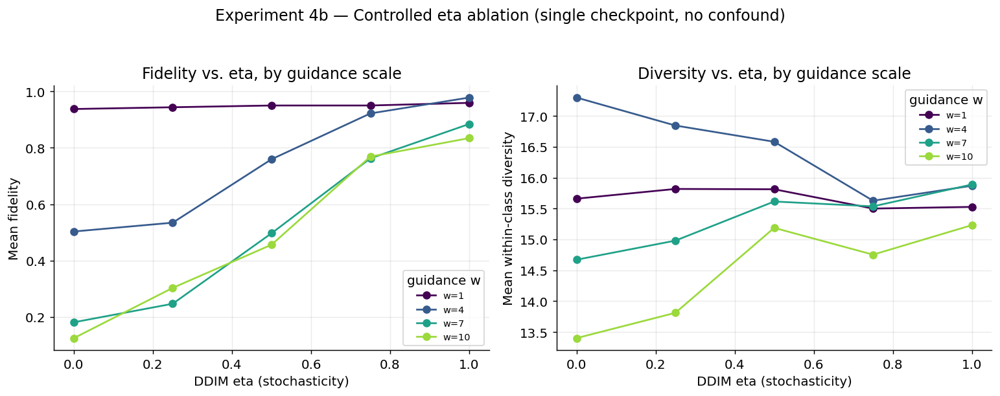
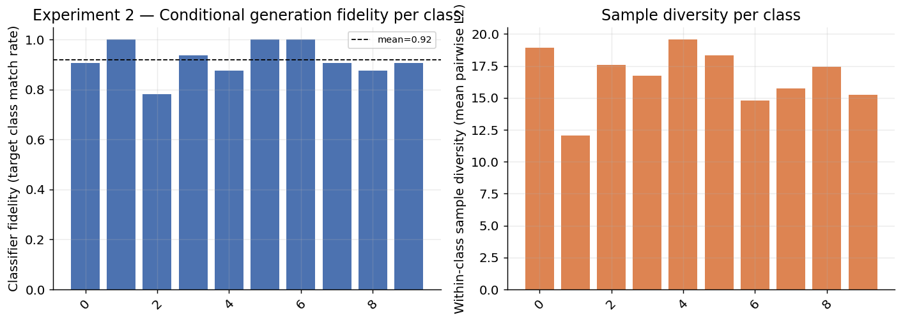
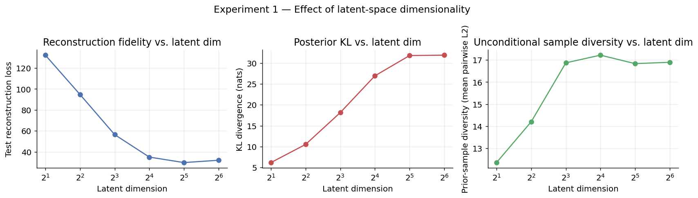

# Generative Deep Learning: Latent Representations and Diffusion Models

A VAE learning compact latent representations, extended with a
**conditional diffusion model trained directly in that latent space**
(latent diffusion, à la Rombach et al. 2022). The project studies how
latent dimensionality and conditioning strength affect generation quality
and sample diversity — and includes a from-scratch NumPy-verified math
suite that caught two real, non-obvious bugs in the sampling code before
they could quietly produce misleading results (see below).

Full methodology and results: **[REPORT.md](REPORT.md)**.

## Results at a glance

**The controlled finding: deterministic DDIM sampling is fragile under
strong classifier-free guidance — and it's fixable.** Every point below
comes from the *same trained checkpoint*; only the DDIM stochasticity
(`eta`) and guidance scale change. Fidelity vs. eta correlates at
**0.97–0.99** across every guidance scale tested:



At `w=10`, moving from `eta=0` to `eta=1` recovers fidelity from **0.125
to 0.834** — same model, same guidance strength, only the sampler's
stochasticity changed.

**Conditional generation quality (ancestral sampling).** The core
generative model produces per-class-recognizable samples reliably once
the sampler issues above are accounted for — see the per-class
fidelity/diversity breakdown and example generated digits:



**Effect of latent dimensionality.** Reconstruction fidelity improves
with latent dimension with clear diminishing returns past ~16–32
dimensions — the point where adding capacity stops meaningfully helping:



More figures (sampling-steps speed/quality trade-off, the original
guidance-scale sweep, example latent-space structure) are in
[`figures/`](figures/) and discussed in [REPORT.md](REPORT.md).

## The debugging story (worth reading before you judge this by the numbers alone)

This repo was authored in an environment with **no GPU, no PyTorch, and no
internet access**. That constraint shaped the whole development process
in a way that turned out to matter:

1. **The math was verified independently first.** Every closed-form
   formula used by training/sampling — noise schedule, forward process,
   closed-form KL divergence, the DDPM reverse-step posterior identity,
   and the generalized-DDIM `eta` identity — is implemented once in
   framework-agnostic code (`src/diffusion_utils.py`) and checked against
   its known theoretical properties with a **35-check NumPy-only test
   suite** (`verify/verify_math.py`), runnable with zero ML-framework
   install:

   ```bash
   python verify/verify_math.py
   ```

2. **When the PyTorch code was finally run for real, DDIM sampling
   quietly produced bad results** — fidelity flat around 0.55–0.60
   regardless of sampling-step count, which is not what real
   speed/quality degradation looks like. Tracing it down (see
   `diagnose_ddim.py`) found a genuine numerical-stability bug: DDIM's
   `z0` prediction divides by `sqrt(alpha_bar_t)`, which is ~`2.4e-9` near
   the end of the noise schedule — amplifying any small denoiser
   prediction error by **~20,000×**. Fixed by clipping the predicted
   `z0` to a data-driven range from the real training-latent statistics
   (the standard production fix, e.g. HuggingFace `diffusers`'
   `clip_sample`) — and now encoded as a permanent regression test.

3. **Fixing that revealed a second, subtler effect**, this time not a bug:
   deterministic (`eta=0`) DDIM sampling is measurably more fragile under
   strong classifier-free guidance than stochastic sampling, because
   guidance extrapolation pushes the trajectory off-distribution with no
   stochastic correction to pull it back. Quantified with a controlled,
   single-checkpoint ablation (`run_eta_sweep.py`) rather than just
   asserted — see the figure above.

Both findings are documented as regression tests in `verify/verify_math.py`
so they can't silently reappear, and both are discussed in `REPORT.md`
rather than smoothed over.

## Quickstart (Colab or any GPU machine)

```bash
git clone <this-repo>
cd genai_project
pip install -r requirements.txt
cd src
python experiments.py --dataset mnist --ddim_eta 1.0   # main pipeline (~15-40 min on Colab GPU)
python run_eta_sweep.py                                  # controlled eta x guidance ablation (~2-5 min)
python visualize.py
```

## Structure

```
src/
  data.py                 MNIST / Fashion-MNIST loading (torchvision)
  vae.py                  convolutional VAE, configurable latent dim
  diffusion_utils.py       framework-agnostic diffusion math (VERIFIED, see verify/)
  diffusion_model.py       conditional MLP denoiser + DDPM/DDIM sampling, incl. eta (PyTorch)
  classifier.py             small CNN used only to SCORE generated samples
  train_utils.py            VAE / diffusion training loops
  experiments.py            the main computational studies (run this)
  diagnose_ddim.py           checkpoint-reusing diagnostic used to isolate the DDIM bugs
  run_eta_sweep.py            controlled Experiment 4b (eta x guidance, single checkpoint)
  visualize.py                all figures (run after experiments.py)
verify/
  verify_math.py             NumPy-only correctness checks (35 checks) for the diffusion/VAE math
results/                    CSVs + raw arrays written by experiments.py
figures/                     PNGs written by visualize.py
REPORT.md                    full write-up: formulation, methodology, results, debugging notes
```

## What's implemented, mapped to the CV bullets

1. **VAE with compact latent representations** (`vae.py`) — convolutional
   encoder/decoder, closed-form KL regularizer (verified formula).
2. **Conditional diffusion model in latent space** (`diffusion_model.py`)
   — DDPM forward process, ancestral sampling, and generalized DDIM
   sampling with a tunable stochasticity (`eta`) parameter; classifier-free
   guidance for conditioning.
3. **Effect of latent dimensionality / conditioning on quality & diversity**
   (`experiments.py`, `run_eta_sweep.py`) — latent-dim sweep, per-class
   conditional-generation fidelity/diversity, DDIM steps speed/quality
   trade-off, guidance-scale trade-off, and a controlled eta ablation.
4. **Computational experiments with visual results** (`visualize.py`) —
   dimensionality curves, latent-space scatter plots, sample grids, and
   trade-off curves, all generated from real run data.
